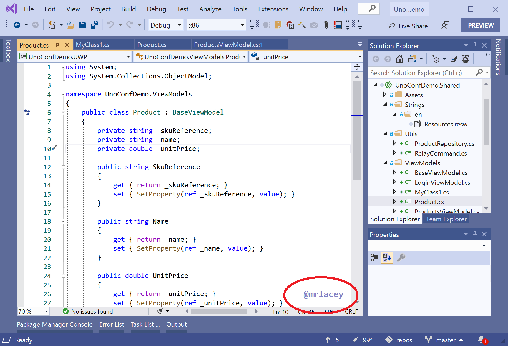
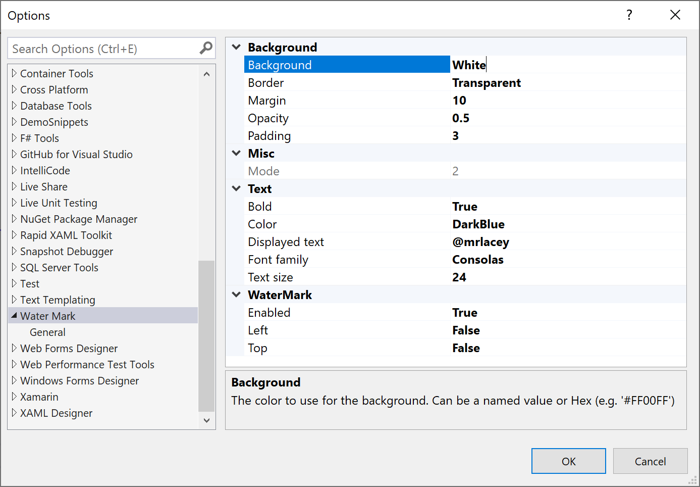

# VSWaterMark

Display a text watermark over the Visual Studio editor.

Ensure your name, handle, URI, or other important text is always visible on the screen.
This can be useful for presentations, demos, screen casts, or streaming as it ensures that this text is always visible, even on photos or screen captures.

The highlighted text may appear part of the text in the editor but is actually floating above it. It stays put when you scroll.

## Fully Configurable

Size, position, color, and text are fully configurable.

Go to **Tools** &gt; **Options** and select **Water Mark**

### Use placeholders

Show something different for each file with placeholders.
This can help you (or anyone looking at the screen) differentiate files more easily.

Simply enter one of the following in the configured `Displayed text` and it will be replaced when shown in the editor.

- **`$(currentFileName)`** - is replaced with the name of the current file.
- **`$(currentDirectoryName)`** - is replaced with the name of the directory (on disk) that contains the current file.
- **`$(currentProjectName)`** - is replaced with the name of the project (within the solution) the file is in.

If any of the placeholders can't be resolved they're replaced with an empty string.  
You can use multiple placeholders at once and combine with other text.  
Placeholders are not case-sensitive.

## Available in the Marketplace

Get it from the [Visual Studio Marketplace](https://marketplace.visualstudio.com/items?itemName=MattLaceyLtd.WaterMark).

## Help make it better

If you have any requests or suggestions, please [raise an issue](https://github.com/mrlacey/VSWaterMark/issues/new).

If you like it, please [leave a review on the marketplace](https://marketplace.visualstudio.com/items?itemName=MattLaceyLtd.WaterMark&ssr=false#review-details).

Help the development and support of this and other extensions by [becoming a sponsor](https://github.com/sponsors/mrlacey).
